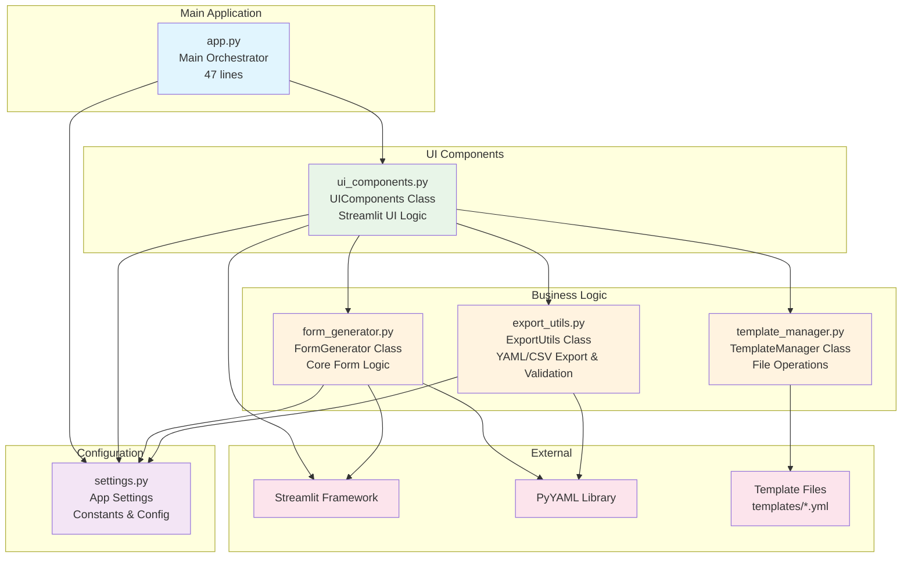

# Dynamic YAML Form Generator

A clean, modular Streamlit application that generates dynamic forms from YAML templates with built-in validation and export capabilities.


## 🚀 Quick Start

### Prerequisites

- Python 3.10+
- [uv](https://docs.astral.sh/uv/) package manager

### Installation

1. **Clone or download the project**
2. **Install uv** (if not already installed):
```sh
   curl -LsSf https://astral.sh/uv/install.sh | sh
```

3. **Run the application**:
```sh
   ./run.sh
```

The application will automatically:
- Install dependencies via uv
- Start the Streamlit server
- Open in your browser at `http://localhost:8501`

## 🏗️ Architecture

### System Overview



### Module Structure

- **`app.py`** (47 lines) - Clean main orchestration layer
- **`form_generator.py`** - Core form generation logic (separated from UI)  
- **`export_utils.py`** - YAML/CSV export and validation utilities
- **`template_manager.py`** - Template file loading and management
- **`ui_components.py`** - All Streamlit UI logic and components
- **`settings.py`** - Cleaned up configuration constants

### Automated GIF Demo Generation

Generate a professional demo GIF automatically using Playwright:
```rust
# Complete pipeline
./gif-demo/demo.sh pipeline

# Individual commands
./gif-demo/demo.sh setup     # One-time setup
./gif-demo/demo.sh prepare   # Create sample templates
./gif-demo/demo.sh generate  # Generate GIF (requires running app)

# Custom GIF name and size limit
GIF_NAME=highway-demo.gif SIZE_LIMIT_MB=0.8 ./gif-demo/demo.sh pipeline

# Higher quality settings
FPS=8 FINAL_WIDTH=600 FINAL_HEIGHT=780 ./gif-demo/demo.sh generate

# Different project content
PROJECT_NAME="My Custom Project" TEMPLATE_FILE=custom.yml ./gif-demo/demo.sh pipeline

```

See `./gif-demo/demo.sh help` for full configuration options.


