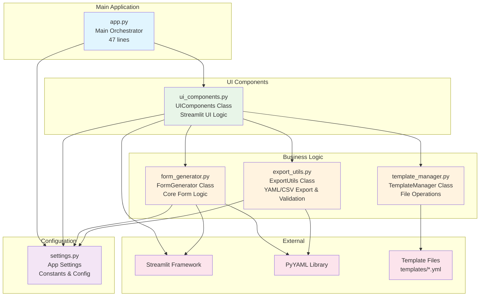

# Dynamic YAML Form Generator

A clean, modular Streamlit application that generates dynamic forms from YAML templates with built-in validation and export capabilities.

## 🚀 Quick Start

### Prerequisites

- Python 3.10+
- [uv](https://docs.astral.sh/uv/) package manager

### Installation

1. **Clone or download the project**
2. **Install uv** (if not already installed):
```sh
   curl -LsSf https://astral.sh/uv/install.sh | sh
```

3. **Run the application**:
```sh
   ./run.sh
```

The application will automatically:
- Install dependencies via uv
- Start the Streamlit server
- Open in your browser at `http://localhost:8501`

## 🏗️ Architecture

### System Overview



### Module Structure

- **`app.py`** (47 lines) - Clean main orchestration layer
- **`form_generator.py`** - Core form generation logic (separated from UI)  
- **`export_utils.py`** - YAML/CSV export and validation utilities
- **`template_manager.py`** - Template file loading and management
- **`ui_components.py`** - All Streamlit UI logic and components
- **`settings.py`** - Cleaned up configuration constants

### Key Benefits

1. **Modularity**: Each module has a single, well-defined responsibility
2. **Testability**: Business logic separated from UI makes unit testing easier
3. **Maintainability**: Changes in one module minimally impact others
4. **Reusability**: Core logic can be reused in different contexts
5. **Clarity**: Clear separation of concerns makes code easier to understand
6. **Scalability**: Easy to extend with new features or modify existing ones
