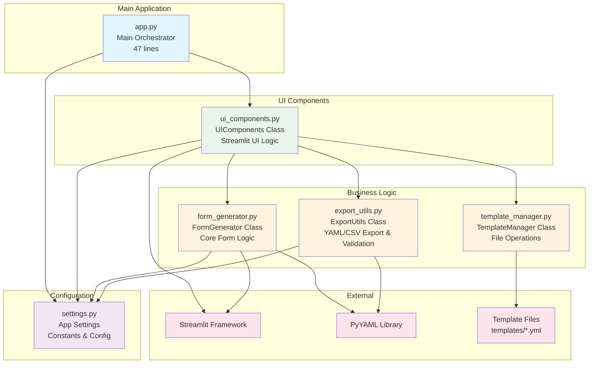
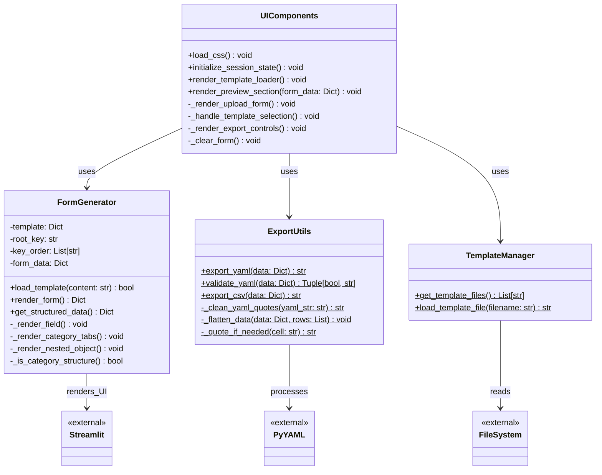
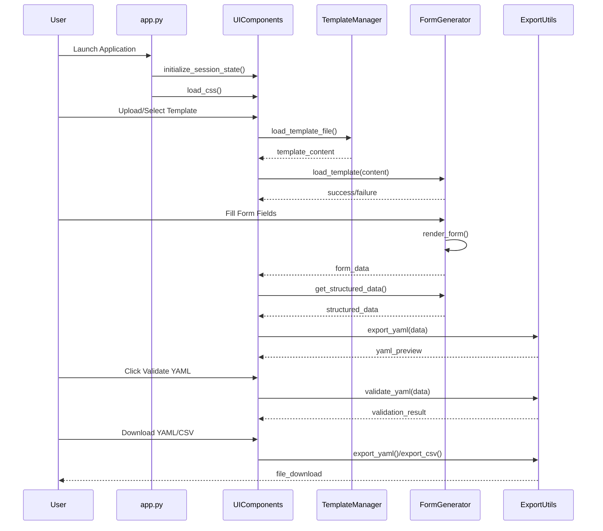
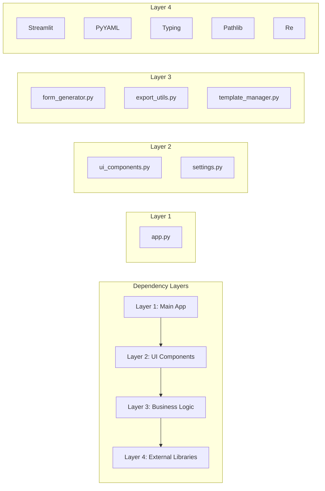

# Dynamic YAML Form Generator - Architecture

## System Architecture Diagram

## Class Relationships

## Data Flow

## Module Dependencies

## Key Benefits of This Architecture

1. **Modularity**: Each module has a single, well-defined responsibility
2. **Testability**: Business logic separated from UI makes unit testing easier
3. **Maintainability**: Changes in one module minimally impact others
4. **Reusability**: Core logic can be reused in different contexts
5. **Clarity**: Clear separation of concerns makes code easier to understand
6. **Scalability**: Easy to extend with new features or modify existing ones
